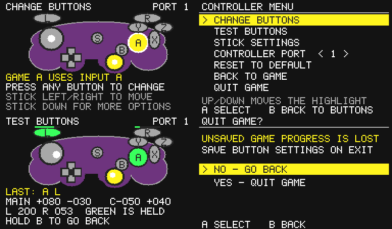

# In-game controller menu (experimental)

Pause the game first. Start + X + Y opens the controller picture; press the
same chord again to apply edits and resume. The overlay consumes controller
input while open, but it does **not** pause game logic.

Move the main stick left/right to select a GameCube output. Press and release
one button to assign its normalized input. Existing assignments swap. The
underlying Nintendont controller profile has already translated physical
buttons: an on-screen A/B/X/Y name is a GameCube input name, and may not match
the printing on an Xbox or other controller. Move while holding a button to
cancel capture; simultaneous button presses do not assign.

Stick down opens the list. D-pad or stick navigates it, A selects, and B
returns. TEST BUTTONS shows pre-remap inputs, sticks and triggers; hold B to
leave. STICK SETTINGS swaps/inverts axes. RESET TO DEFAULT requires two A
presses. BACK TO GAME applies edits. QUIT GAME starts on NO; Down then A on
YES applies edits and exits Nintendont.

## Saving and limits

Edits become active on returning to the game, but write to disk only during
the ordinary Nintendont reload/exit path, after DI and memory-card activity
stop and before FAT unmount. QUIT GAME uses that path. Existing working
Home/Power-mapped reload shortcuts also use it. A console shutdown, hard
reset, crash or unplug is not a guaranteed save. An external exit while the
editor is open saves the previously applied map, not unfinished edits.

Two checksummed 96-byte `/ninmap-m15-0.bin` and `/ninmap-m15-1.bin` files
preserve M15–M21 compatibility. They apply by port across games and devices;
they are not game-specific or device-specific profiles. The previous valid
slot survives an incomplete alternate write. Logs use `/vi_m21.log` during
the experimental phase: mapping_save=1 means verified write/read-back;
0 means no write (unchanged map or uninstalled/inactive state); negative
values indicate a validation or filesystem failure.

The feature needs a recognized SDK VI handler and the normal patched
PADRead path. Native SI, alternate/custom handlers, Triforce, multi-DOL
transitions, PAL/interlaced modes and vWii need separate hardware coverage.
The code validates a 384x224 MEM1 rectangle; unsupported display states do
not draw. The input path checks the same complete layout before opening.
If the display becomes unsupported while editing, unfinished edits are
cancelled and game input returns after the held buttons are released.

Legacy reset/exit chords are checked in the source-specific controller
paths before the overlay. They can still fire while testing combinations.
Single-button testing is covered; arbitrary reset/exit combinations are
not intercepted. This remains an upstream integration decision.

The picture requires a usable main stick and the entry chord requires three
buttons. An accessible alternate entry/navigation method is future work.
Do not describe this prototype as universally accessible or compatible.

## Validation status

On 18 September 2026, the tester reconfirmed that the M21 menu worked on Wii;
the identified test setup was Wind Waker and an Xbox controller. The tester
subsequently confirmed that saving works in M21. That build included a separate
Xbox USB transport; this menu-only PR uses stock upstream controller support.

The revised source builds with devkitARM r53-1, devkitPPC r35-2 and libOGC
1.8.23-1. Six compiled PPC/ARM suites cover button assignments and transitions,
video rejection, register preservation, save failure/recovery, entry/exit and
VI candidate validation. They do not replace hardware checks of the revised
installation/cache and save changes on the final PR build. See
tests/overlay/README.md.

This preview comes from the compiled PPC renderer under Unicorn with simulated
inputs. It is a UI illustration, not an additional hardware test.

## Architecture and provenance

The ARM kernel loads mappings into kernel-owned pending state while the
loader is alive. The patcher installs the PPC module and state only at game
handoff. The PPC cache sweep includes code and state; shared runtime fields
use aligned 32-bit uncached stores. Input changes exclude interrupts;
the VI return hook preserves integer registers/flags and calls the integer
renderer. No filesystem operations occur in the menu/VI callback.

VI signature and OSSetCurrentContext-call research derives from
[Swiss patcher.c](https://github.com/emukidid/swiss-gc/blob/master/cube/swiss/source/patcher.c),
by emu_kidid and contributors, under its
[GPL v2 license](https://github.com/emukidid/swiss-gc/blob/master/LICENSE).
Nintendont kernel files are GPL v2. The controller drawing uses original
integer primitives; no third-party controller image is shipped. The module
links only the explicitly allowlisted GCC register/division helpers under
the toolchain's existing runtime exception; see kernel/be/COPYING.RUNTIME.
